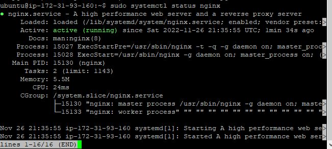

# WEB STACK IMPLEMENTATION (LEMP STACK) ON AWS
### This project shows the web stack implementation of LEMP (Linux, NGINX, MySQL, PHP) on AWS

## STEP 0 - Prerequisite
In order to complete this project, you will need an AWS account and a virtual server with Ubuntu Server OS. 

## STEP 1 – INSTALLING THE NGINX WEB SERVER
Update a list of packages in package manager on the Ubuntu server

`sudo apt update`

Run nginx package installation

`sudo apt install nginx -y`

verify that nginx is running as a Service
    
`sudo systemctl status nginx`



check if apache is accessible locally in Ubuntu shell

`curl http://localhost:80 ` or `curl http://127.0.0.1:80`
 
 *These 2 commands above actually do pretty much the same – they use ‘curl’ command to request our Nginx on port 80 (actually you can even try to not specify any port – it will work anyway)*

From the browser, check if nginx server respond to requests from the Internet.  
    `http://<Public-IP-Address>:80`
    
If you see following page, then your web server is now correctly installed and accessible through your firewall
 


## STEP 2 — INSTALL MYSQL

Install Mysql on the ubuntu server

`sudo apt install mysql-server -y`

Login to the MySQL

`sudo mysql`

set a password for the root user, using mysql_native_password as default authentication method

`ALTER USER 'root'@'localhost' IDENTIFIED WITH mysql_native_password BY 'PassWord.1';`

Exit the MySQL shell
    `exit`

Start the interactive script by running

`sudo mysql_secure_installation`

Note: This will ask if you want to configure the VALIDATE PASSWORD PLUGIN. You would need to set a strong, unique passwords for database credentials.
For the rest of the questions, press Y and hit the ENTER key at each prompt.

Test if you’re able to log in to the MySQL console with the new password.

`sudo mysql -p`

## STEP 3 – INSTALL PHP

Install these 2 packages

`sudo apt install php-fpm php-mysql -y`

## STEP 4 — CONFIGURE NGINX TO USE PHP PROCESSOR

Create the root web directory for your domain

`sudo mkdir /var/www/projectLEMP`

Assign ownership of the directory with the $USER environment variable, which will reference your current system user

`sudo chown -R $USER:$USER /var/www/projectLEMP`

Open a new configuration file in Nginx’s sites-available directory using your preferred command-line editor

`sudo vi /etc/nginx/sites-available/projectLEMP`

Paste in the following bare-bones configuration

```
#/etc/nginx/sites-available/projectLEMP
 
server {
	listen 80;
	server_name projectLEMP www.projectLEMP;
	root /var/www/projectLEMP;
 
	index index.html index.htm index.php;
 
	location / {
    	try_files $uri $uri/ =404;
	}
 
	location ~ \.php$ {
    	include snippets/fastcgi-php.conf;
    	fastcgi_pass unix:/var/run/php/php8.1-fpm.sock;
 	}
 
	location ~ /\.ht {
    	deny all;
	}
 
}
```
*Note: Point this directive to your server’s domain name or public IP address*

Activate your configuration by linking to the config file from Nginx’s sites-enabled directory

`sudo ln -s /etc/nginx/sites-available/projectLEMP /etc/nginx/sites-enabled/`

Test your configuration for syntax errors

`sudo nginx -t`

You shall see following message


Disable default Nginx host that is currently configured to listen on port 80

`sudo unlink /etc/nginx/sites-enabled/default`

Reload Nginx to apply the changes

`sudo systemctl reload nginx`

Create an index.html file in that location so that we can test that your new server block works

```
sudo echo 'Hello LEMP from hostname' $(curl -s http://169.254.169.254/latest/meta-data/public-hostname) 'with public IP' $(curl -s http://169.254.169.254/latest/meta-data/public-ipv4) > /var/www/projectLEMP/index.html
```

go to your browser and try to open your website URL using IP address or public DNS name.

`http://<Public-IP-Address>:80` or `http://<Public-DNS-Name>:80`


## STEP 5 – TEST PHP WITH NGINX

Open a new file 

`sudo nano /var/www/projectLEMP/info.php`

Paste the following lines into the new file

```
<?php
phpinfo();
```

Access the page in your web browser 

`http://server_domain_or_IP/info.php`


Remove the file you created as it contains sensitive information about your PHP environment -and your Ubuntu server

`sudo rm /var/www/your_domain/info.php`

## STEP 6 – RETRIEVE DATA FROM MYSQL DATABASE WITH PHP

Create a database named **example_database** and a user named **example_user**. Connect to the MySQL console using the root account

`sudo mysql`

To create a new database, run the following command from your MySQL console

```
CREATE DATABASE `example_database`;
```

Create a new user and grant him full privileges on the database

```
CREATE USER 'example_user'@'%' IDENTIFIED WITH mysql_native_password BY 'Your-Password'
```

Give this user permission over the **example_database** database

```
GRANT ALL ON example_database.* TO 'example_user'@'%';
```

exit the MySQL shell `exit`

Test if the new user has the proper permissions by logging in to the MySQL console

```
mysql -u example_user -p
```
*Notice the -p flag in this command, which will prompt you for the password used when creating the example_user user. After logging in to the MySQL console, confirm that you have access to the example_database database*

```
SHOW DATABASES;
```


Create a test table named todo_list

```
CREATE TABLE example_database.todo_list (
item_id INT AUTO_INCREMENT,
content VARCHAR(255),
PRIMARY KEY(item_id)
);
```

Insert a few rows of content in the test table

```
INSERT INTO example_database.todo_list (content) VALUES ("My first important item");
```

Confirm that the data was successfully saved to your table

```
SELECT * FROM example_database.todo_list;
```


exit the MySQL console `exit`

Create a new PHP file in your custom web root directory using your preferred editor

`vi /var/www/projectLEMP/todo_list.php`

Copy this content into your todo_list.php script

```
<?php
$user = "example_user";
$password = "Your-Password";
$database = "example_database";
$table = "todo_list";
 
try {
  $db = new PDO("mysql:host=localhost;dbname=$database", $user, $password);
  echo "<h2>TODO</h2><ol>";
  foreach($db->query("SELECT content FROM $table") as $row) {
	echo "<li>" . $row['content'] . "</li>";
  }
  echo "</ol>";
} catch (PDOException $e) {
	print "Error!: " . $e->getMessage() . "<br/>";
	die();
}
```

Save and close the file

Access the page in your web browser

`http://<Public_domain_or_IP>/todo_list.php`


THANK YOU!!!
